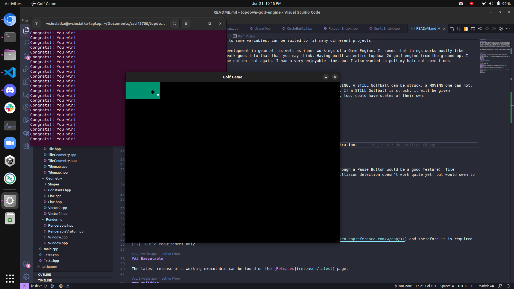

# topdown-golf-engine
Topdown 2D Golf Engine for the Game Engine assignment for Andy Harris's CSCI 43700.

## Documentation
### Things I Learned

There are many things that I learned while working on this project. One of the things I learned was why we trust git - I had an incident with adjusting my [Makefile](Makefile)'s `clean` target, and deleted my entire local copy of the project. Thankfully, `git restore` had me covered. Consequentially, I also learned a __lot__ about Makefiles. I once dreaded writing them and having to laboriously write dependencies and file names by hand, but no more! By learning how to properly utilize Make's patterns and functions, I was able to write a general-purpose Makefile that I can set and forget! It is easily configurable and, with a few minor changes to some variables, can be suited to fit many different projects!

Additionally, I learned a lot about Game Development in general, as well as inner workings of a Game Engine. It seems that things works mostly like you'd expect them to, but that a lot more work goes into that than you may think. Having built an entire topdown 2d golf engine from the ground up, I feel that the #1 thing I learned is to maybe not do that again. I had a very enjoyable time, but I also wanted to pull my hair out some times.

### State Map

There are not many states to keep track of. The Golfball Entity has two states, STILL and MOVING. A STILL Golfball can be struck, a MOVING one can not. When a MOVING Golfball no longer has acceleration, it becomes STILL, and one point is gained. If a STILL Golfball is struck, it will be given acceleration, and will become MOVING. I imagine if I added support for other obstacles, they, too, could have states of their own.

### UML

I did not make a UML.

### Video

Unfortunately, my video drivers are not working, and I was not able to upload a video demonstration. Below are two screenshots:

Pre-strike:

Post-strike:

### Where Things Stand

As it stands, the game renders. It can be paused/unpaused (through gaining/losing focus, although a Pause Button would be a good feature). Tile management works. Entities can move around, and the player can strike the ball to move it. Collision detection doesn't work quite yet, but would seem to be an easy fix. 

## Installation

### Requirements

- [SFML](https://www.sfml-dev.org/)
- C++11[^1]
- G++[^2]

[^1]: Note that this project makes use of some features of C++ introduced in [C++11](https://en.cppreference.com/w/cpp/11) and therefore it is required.
[^2]: Build requirement only.

### Executable

The latest release of a working executable can be found on the [Releases](releases/latest) page.

### Building

If you wish to build from source, clone the repository to your system and run `make all`.

## Running

The executable may be run on Linux machines with `./golf_engine.out`. Additionally, if you wish to build from source, you can also build and run the project with `make run`.

## Author

Willow Ciesialka